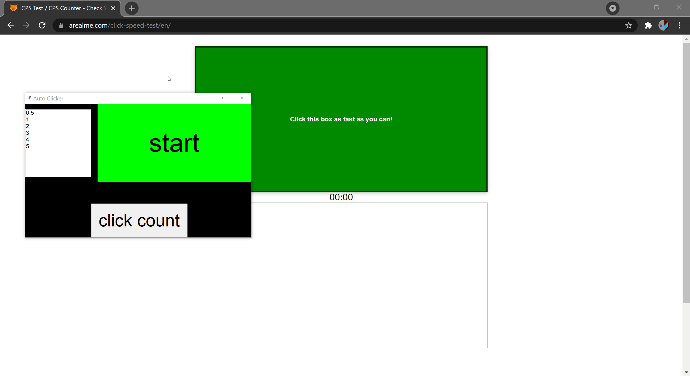

 
<h3 align="center">Auto Clicker</h3>
<h2></h2>

 

## Description
A simple auto clicker created using pyautogui and tkinter for the GUI. The program uses multithreading so the main application is always responsive while we wait in between clicks.  
An alternative way to stop the auto clicker is to place your mouse in any of the four corners of the screen.

## Demo

## Requirements
* Python 3.8.10+

## Contributions
Contributions are always welcome!  
Just make a [pull request](../../pulls).

## Licence
MIT license
